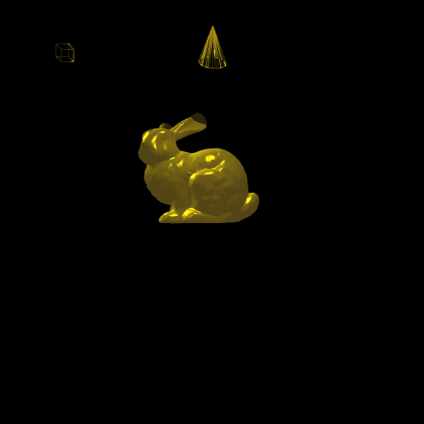

# WebGLbunny

A short project using WebGL libraries to render a realtime 3D bunny with a spot and point lighting.
Uses the Phong Model to bring realistic shader to the rendering.

## Demo

    
## Installation and setup

1. Download and extract the zip file
2. Run the bunny.html file

## Instructions

Press any of the following on your keyboard:
* [s] : Stop the movement of the spotlight
* [p] : Stop the movement of the pointlight
